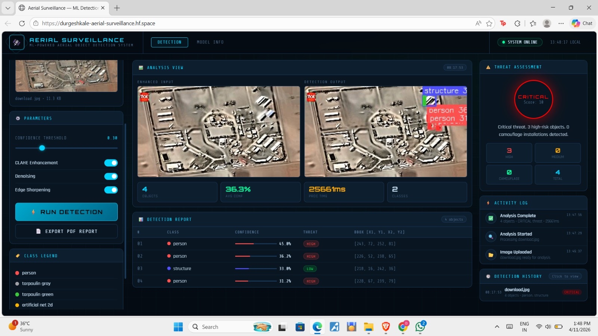
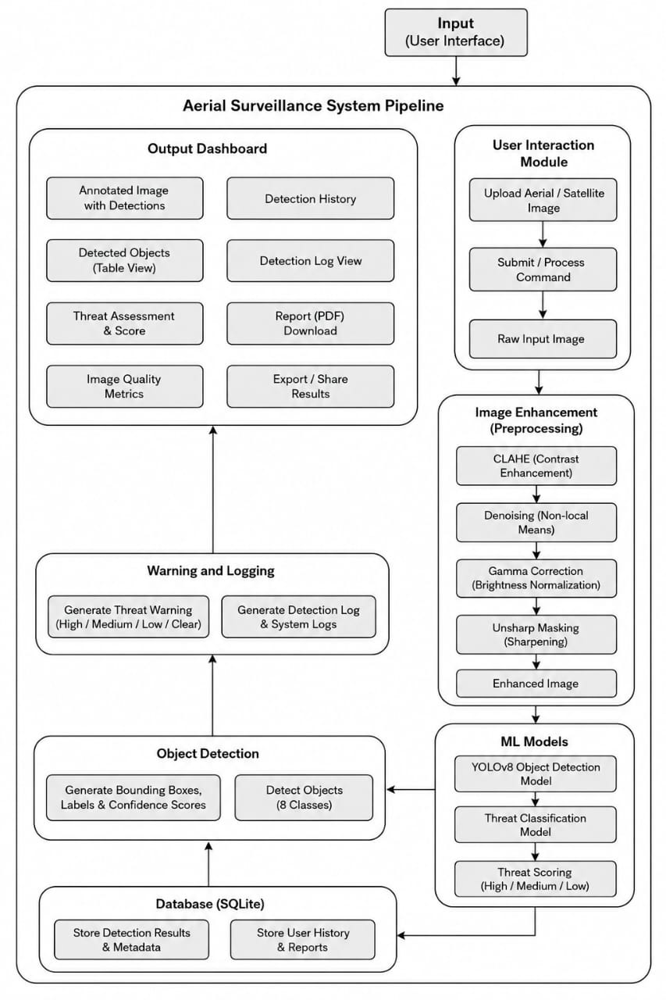
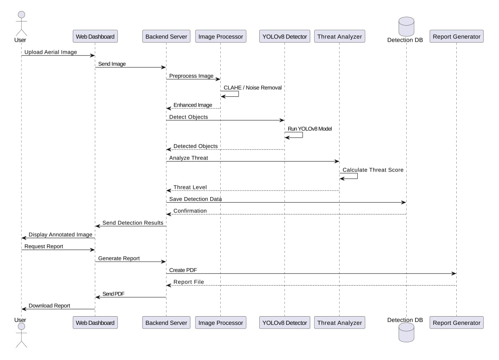
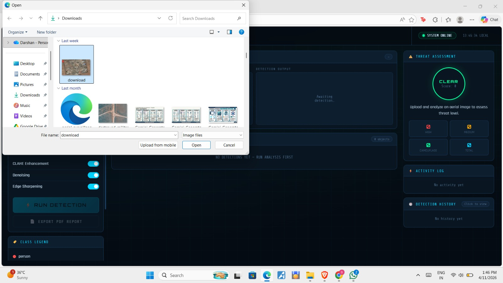
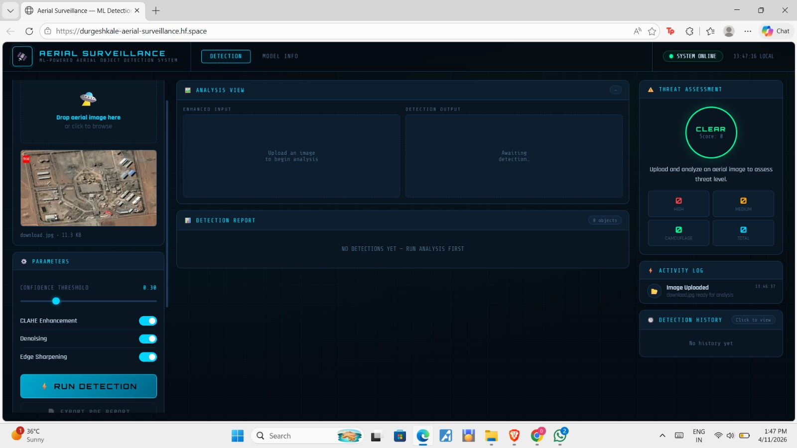
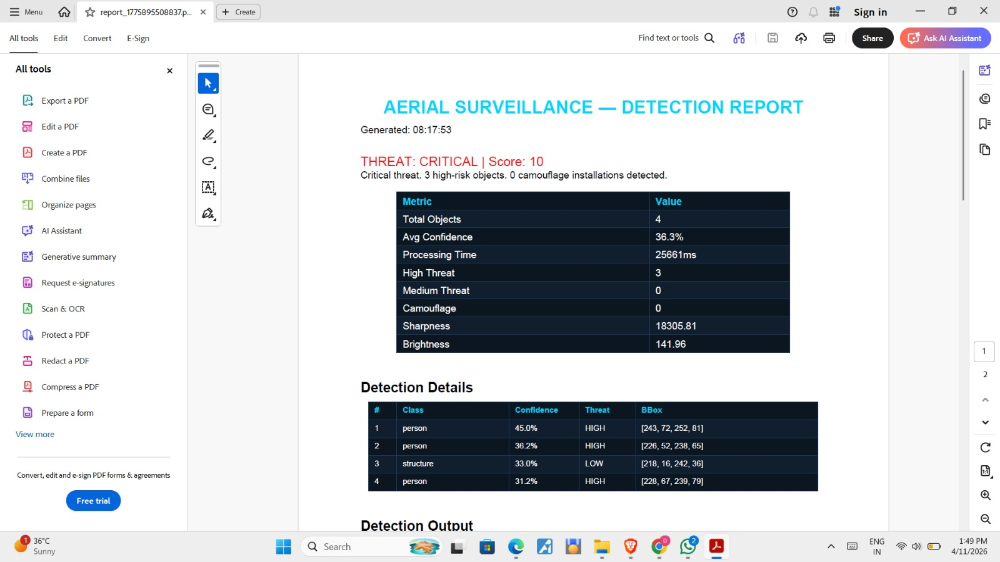

# 🛰️ AI-Powered Aerial Surveillance System using YOLOv8

> Intelligent aerial image analysis and threat detection system using **YOLOv8**, computer vision, image enhancement, and tactical threat assessment.

---

## 🌐 Live Demo

🚀 Hugging Face Deployment:  
https://durgeshkale-aerial-surveillance.hf.space/

---

## 📌 Overview

This project is an AI-powered aerial surveillance platform designed for automated object detection and tactical assessment from aerial or drone imagery.

The system integrates:

- YOLOv8 object detection
- Image enhancement pipeline
- Tactical threat assessment
- Interactive dashboard
- PDF surveillance report generation

The platform is capable of identifying aerial objects and generating actionable surveillance insights through an end-to-end ML pipeline.

---

## 🖥️ Dashboard Preview



---

## 🚀 Key Features

- 🎯 YOLOv8-based aerial object detection
- 🛰️ Tactical threat assessment engine
- 🧠 Image enhancement using CLAHE and denoising
- 📄 Automated PDF surveillance report generation
- 🌐 Interactive Flask dashboard
- 📊 Detection confidence visualization
- 📁 Upload and analyze aerial imagery
- ☁️ Deployable on Hugging Face Spaces using Docker

---

## 🏗️ System Architecture



---

## 🔄 System Workflow



---

## 📷 Application Workflow

### Upload & Analysis



---

### Parameter Configuration



---

### Surveillance Report Export



---

## 🧠 Technology Stack

| Category | Technologies |
|---|---|
| Language | Python |
| Deep Learning | YOLOv8, PyTorch |
| Backend | Flask |
| Frontend | HTML, CSS, JavaScript |
| Image Processing | OpenCV |
| Deployment | Hugging Face Spaces, Docker |
| Reporting | ReportLab |
| Dataset | VisDrone2019-DET |

---

## 📊 Model Performance

| Metric | Value |
|---|---|
| mAP@50 | 68.21% |
| Precision | 78.65% |
| Recall | 60.34% |
| mAP@50:95 | 39.80% |

---

## 🎯 Detectable Classes

- Person
- Structure
- Artificial camouflage net
- Artificial grass mat
- Artificial hedge
- Tarpaulin camouflage

---

## ☁️ Deployment

The project is deployed using:

- Hugging Face Spaces
- Docker
- Flask backend
- Gunicorn WSGI server

---

## ⚙️ Installation

Install dependencies:

```bash
pip install -r requirements.txt
```

Run the dashboard locally:

```bash
python dashboard/app.py
```

---

## 📚 Future Improvements

- Real-time video surveillance
- Live drone feed integration
- Multi-object tracking
- Expanded military-grade datasets
- Satellite imagery support
- Advanced threat intelligence

---

## 👨‍💻 Author

**Durgesh Kale**  
B.Tech CSE — Government College of Engineering Nagpur

---

## 🤝 Acknowledgements

This project was developed as part of a B.Tech group project submission at  
Government College of Engineering Nagpur.

### Team Members

- Darshan Narad
- Vansh Ikharkar
- Sanika Gotmare
